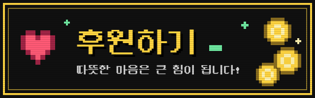

# NX-MVMZPLAYER

> RPG Maker MV/MZ Player — **Public Beta 0.1**

[](../../releases)
[](LICENSE)

**NX-MVMZPLAYER** is a player project for detecting and launching RPG Maker MV/MZ game folders.

- 🇰🇷 [한국어 사용법](README_KR.md)
- 🇺🇸 [English Guide](README_EN.md)

> This is a public beta. Compatibility can vary depending on each game's project and plugin configuration.

## Quick Start

1. Download the latest **Public Beta** package from [Releases](../../releases).
2. Copy the files from the archive without changing the included folder structure.
3. Create your game folders under:

```text
/mvmz/
  GameFolder1/
  GameFolder2/
```

4. Copy RPG Maker MV or MZ game data that you legally own into each game folder.
5. Start **NX-MVMZPLAYER** and select a game.
6. The first launch may take a little longer while per-game preparation data is generated. Later launches reuse that data and refresh it automatically when the game files change.

> Game data is **not included** in this project. Use only files that you are legally entitled to use.

---

## Thanks / 감사

This project benefited greatly from the following open-source projects and their contributors.

- **nx.js** — https://github.com/TooTallNate/nx.js
- **PixiJS** — https://github.com/pixijs/pixijs
- **pako** — https://github.com/nodeca/pako
- **pngjs** — https://github.com/pngjs/pngjs
- **Noto CJK** — https://github.com/notofonts/noto-cjk
- **esbuild** — https://github.com/evanw/esbuild
- **TypeScript** — https://github.com/microsoft/TypeScript

Thank you to every maintainer and contributor whose work made this public beta possible.

---

## 후원하기 / Support

<a href="https://litt.ly/sjh5927"></a>
